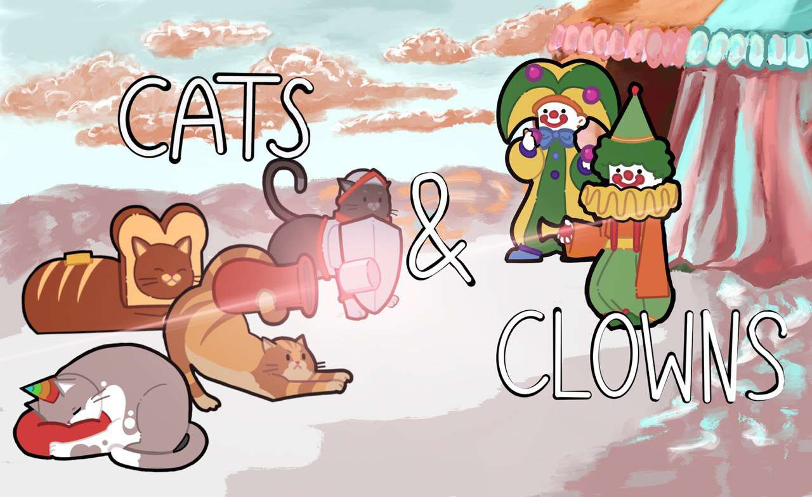
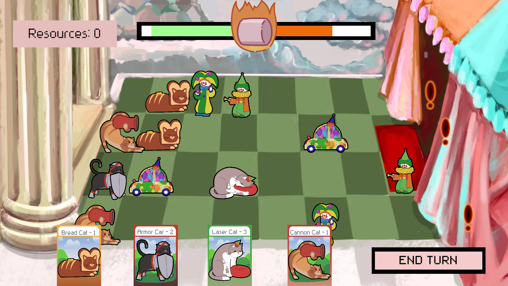

# Cats & Clowns

## KrakJam 2024 Game
### https://globalgamejam.org/games/2024/catsclowns-0

### About

Welcome to Cats&Clowns, a turn-based twist on Plants vs. Zombies! Help the notorious Cat Monk defeat the Devil Clown and his infernal circus in this tactical tower defense. Spend your resources, place adorable cats on board and face off against the waves of clowns but don't let yourselves be overwhelmed - the Devil is waiting for a chance to seize your soul...

### Platforms
MS Windows

### Tools and Technologies
Unity

### Languages
English (English)

### Technology Notes
Clip Studio Paint, Procreate

### Credits:
https://www.dafont.com/rittswood-classic.font
https://opengameart.org/content/some-gui-graphics
https://freesound.org/people/Gimp_Revival/sounds/588570/
https://freesound.org/people/timtube/sounds/61259/
https://freesound.org/people/milton./sounds/162453/
https://freesound.org/people/Carter_Kudrech/sounds/654736/
https://freemusicarchive.org/music/sonic-mystery/single/ancient-mysteries/
